# PocketNest - Family Finances Simplified

<div align="center">
  
  
  <p><strong>Not just another money app</strong> - Beautiful UI/UX meets personalized AI-powered financial guidance.</p>
  
  <p>
    
    
    
    
  </p>

  <p>A premium Flutter mobile application designed for busy parents who want to take control of their family finances in a calm, supportive way.</p>
  
  <p>📥 <strong><a href="https://drive.google.com/drive/folders/1Sy_2_ta4R1w8CoWNJgueayKPg09Qfo0W?usp=sharing">Download PocketNest APK</a></strong></p>
</div>

---

## 📱 Screenshots

<div align="center">
  <table>
    <tr>
      <td align="center">
        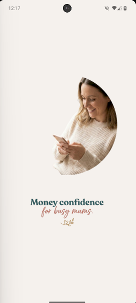
        <br/>
        <sub><b>Splash Screen</b></sub>
      </td>
      <td align="center">
        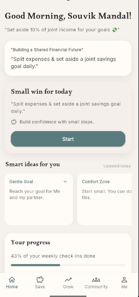
        <br/>
        <sub><b>Home Tab</b></sub>
      </td>
      <td align="center">
        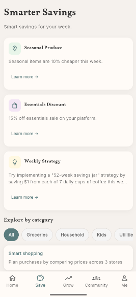
        <br/>
        <sub><b>Save Tab</b></sub>
      </td>
      <td align="center">
        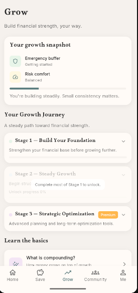
        <br/>
        <sub><b>Grow Tab</b></sub>
      </td>
    </tr>
    <tr>
      <td align="center">
        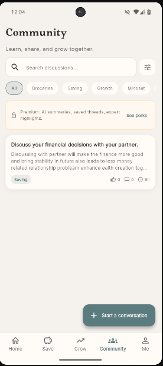
        <br/>
        <sub><b>Community Tab</b></sub>
      </td>
      <td align="center">
        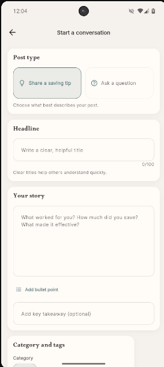
        <br/>
        <sub><b>Create Post</b></sub>
      </td>
      <td align="center">
        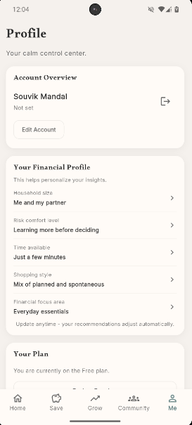
        <br/>
        <sub><b>Profile Tab</b></sub>
      </td>
      <td align="center">
        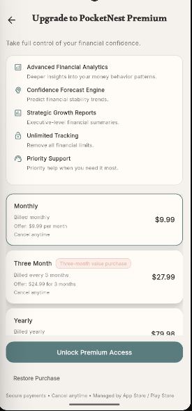
        <br/>
        <sub><b>Premium Paywall</b></sub>
      </td>
    </tr>
  </table>
</div>

---

## 🚀 Quick Start

### Prerequisites
- Flutter SDK 3.10.1+
- Dart 3.10.1+
- Supabase account (free tier works)
- RevenueCat account (for premium subscriptions)

### Setup (4 steps)
1. **Copy environment template:**
   ```bash
   cp .env.example .env
   ```

2. **Add your credentials to `.env`:**
   - Supabase URL and Anon Key ([Get from Supabase Dashboard](https://app.supabase.com))
   - RevenueCat API Key ([Get from RevenueCat Dashboard](https://app.revenuecat.com))
   - Google Web Client ID (for Google Sign-In)
   - Groq API Key (for AI features)

3. **Install dependencies:**
   ```bash
   flutter pub get
   ```

4. **Run the app:**
   ```bash
   flutter run
   ```

## ✨ Key Features

### 🏠 Home Tab
- ✅ **Time-based Greeting** - Good Morning/Afternoon/Evening personalization
- ✅ **AI-Powered Daily Tips** - Contextual guidance from Groq AI
- ✅ **Today's Gentle Step** - Micro-action tasks based on onboarding data
- ✅ **Dynamic Task Selection** - Tasks adapt to user's financial profile
- ✅ **Progress Tracking** - Visual progress indicators and completion states
- ✅ **Reflection Prompts** - Encouraging feedback after task completion

### 💰 Save Tab
- ✅ **Financial Snapshot** - Quick overview of money situation
- ✅ **AI Spending Insights** - Groq-powered personalized recommendations
- ✅ **Premium Preview** - Gated advanced features with paywall entry

### 📈 Grow Tab
- ✅ **Growth Journey Stages** - Structured learning roadmap
- ✅ **Expandable Checklists** - Track progress through each stage
- ✅ **Stage Unlock Logic** - Gamified progression system
- ✅ **Learning Bites** - Bite-sized educational cards with descriptions
- ✅ **Premium Content Preview** - Locked advanced modules with paywall

### 👥 Community Tab
- ✅ **Community Feed** - Real-time posts from other users
- ✅ **Post Creation** - Structured post types (Question, Win, Tip, Discussion)
- ✅ **Guided Prompts** - Context-specific writing assistance
- ✅ **Category & Tags** - Organized content discovery
- ✅ **Comments & Voting** - Full engagement system with upvotes
- ✅ **Post Detail View** - Rich post interactions
- ✅ **Supabase Backend** - Real-time data sync
- ✅ **Premium Community Features** - Gated content with paywall

### 👤 Profile Tab (Me)
- ✅ **Account Overview** - User details with logout option
- ✅ **Edit Account** - Update name and email with Supabase sync
- ✅ **Financial Profile Status** - Visual completion tracking (Not Started/Partial/Complete)
- ✅ **Onboarding Integration** - Easy profile completion flow
- ✅ **Plan Management** - Premium status display
- ✅ **Subscription Control** - RevenueCat Customer Center integration
- ✅ **App Settings** - Notifications, data refresh, privacy, support
- ✅ **Settings Persistence** - Saved to Supabase profiles table

### 🎯 Onboarding
- ✅ **6-Question Flow** - Collects financial preferences and goals
- ✅ **Skip Option** - Optional completion (no forced flow)
- ✅ **Supabase Storage** - Responses stored in `onboarding_responses` table
- ✅ **AI Personalization** - Onboarding data drives AI recommendations

### 💎 Premium & Monetization
- ✅ **RevenueCat Integration** - Full SDK setup (`purchases_flutter` + `purchases_ui_flutter`)
- ✅ **Premium Paywall** - Modern, high-trust design matching app theme
- ✅ **Subscription Plans** - Monthly, 3-month (best value), Yearly
- ✅ **Entitlement Checks** - `PocketNest Premium` entitlement verification
- ✅ **Customer Center** - Native subscription management
- ✅ **Restore Purchases** - Easy purchase restoration
- ✅ **Multi-Entry Paywall** - Accessible from Save, Grow, Community, Profile tabs

### 🔐 Authentication
- ✅ **Google Sign-In** - OAuth integration
- ✅ **Apple Sign-In** - Native iOS authentication
- ✅ **Phone OTP** - SMS verification (Supabase)
- ✅ **Secure Logout** - Full session cleanup

### 🎨 Design & UX
- ✅ **Calm Theme** - Soft beige background, muted teal accents
- ✅ **Premium Typography** - Alkalami headlines, Inter body text
- ✅ **Smooth Animations** - Fade/slide transitions throughout
- ✅ **Rounded UI** - Soft, approachable card design
- ✅ **Universal Language** - Concise, supportive copy (max 10 words for AI prompts)
- ✅ **Responsive Layout** - Works on all screen sizes

### 🧠 AI Integration
- ✅ **Groq AI Service** - Model: `llama-3.1-70b-versatile`
- ✅ **Daily Tips** - Context-aware financial guidance
- ✅ **Card Titles & Descriptions** - Dynamic content generation
- ✅ **Spending Insights** - Personalized money-saving recommendations
- ✅ **Concise Prompts** - 10-word max for fast, focused responses

### Architecture Highlights
- 🏗️ **Flutter Bloc (Cubit)** - Clean state management
- 🎨 **Centralized Theme** - Easy customization via `AppTheme`
- 📦 **Feature-Based Structure** - Scalable organization
- 🔒 **Supabase Backend** - Auth + database with RLS
- 🔐 **Environment Variables** - Secure credential management
- 📱 **Responsive Design** - Adaptive layouts

---

## 🎯 App Flow

```
Launch
  ↓
[SplashState] → 2 seconds
  ↓
Check Auth
  ├─→ No User → [UnauthenticatedState] → Auth Screen
  │
  └─→ Has Session
      ├─→ Profile Incomplete → [ProfileIncompleteState] → Home Screen (optional onboarding)
      └─→ Profile Complete → [AuthenticatedState] → Home Screen
```

**New**: Profile completion is **optional** after login—users can complete onboarding anytime from the Profile tab.

---

## 🎨 Design System

### Color Palette
- **Background**: Soft beige (#F5F1ED)
- **Primary**: Muted teal (#5B7C7E)
- **Accent**: Soft peach (#E8B4A8)
- **Button**: Dark teal (#32575A)
- **Card Background**: Off-white (#FEFDFB)
- **Text Primary**: Near-black (#1A1919)
- **Text Secondary**: Warm gray (#6B6560)

### Typography
- **Headlines**: Alkalami (serif) - Warm, approachable
- **Body**: Inter (sans-serif) - Clean, readable

### Components
- Rounded corners (12-18px)
- Soft shadows
- Premium feel
- Minimal aesthetic
- Calm interactions

---

## 📁 Project Structure

```
lib/
├── main.dart                           # App entry point & routing
├── config/
│   ├── environment_config.dart         # .env reader
│   ├── supabase_config.dart            # Backend setup
│   ├── revenuecat_config.dart          # Premium subscription config
│   └── routes.dart                     # Route definitions
├── core/
│   ├── auth/                           # Auth utilities
│   ├── theme/
│   │   └── app_theme.dart              # Centralized theme
│   ├── navigation/
│   │   └── cubit/
│   │       ├── app_flow_cubit.dart     # Global app state management
│   │       └── app_flow_state.dart     # App flow states
│   ├── services/
│   │   └── revenuecat_service.dart     # Premium subscription service
│   └── utils/
│       ├── app_assets.dart             # Asset path constants
│       └── groq_ai_utils.dart          # AI helper methods
├── features/
│   ├── splash/
│   │   └── screens/splash_screen.dart
│   ├── auth/
│   │   └── screens/auth_screen.dart
│   ├── onboarding/
│   │   └── screens/onboarding_screen.dart
│   ├── home/
│   │   └── screens/
│   │       ├── home_screen.dart
│   │       └── todays_gentle_step_screen.dart
│   ├── save/
│   │   └── screens/save_screen.dart
│   ├── grow/
│   │   └── screens/grow_screen.dart
│   ├── community/
│   │   └── screens/community_screen.dart
│   ├── profile/
│   │   └── screens/profile_screen.dart
│   ├── premium/
│   │   └── screens/premium_paywall_screen.dart
│   └── shared/                         # Shared widgets
└── assets/
    ├── images/
    │   ├── logo/                       # App logo (PNG)
    │   ├── branding/                   # SVG branding assets
    │   └── splash/                     # Splash screen assets
    ├── icons/
    └── fonts/
```

---

## 🏗️ Architecture & Data Flow

### App Architecture Overview

PocketNest follows a **clean architecture** pattern with **feature-based organization** and **BLoC state management**.

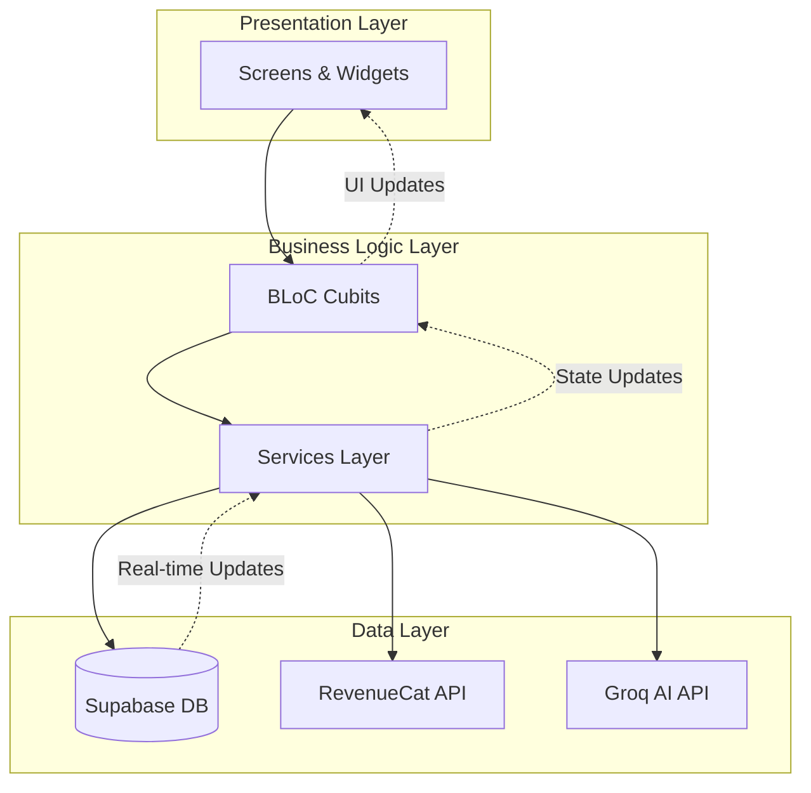

### State Management Flow

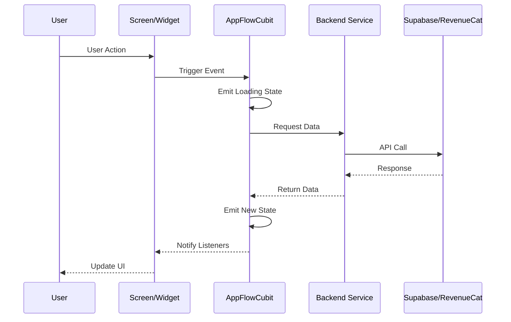

### Application Flow States

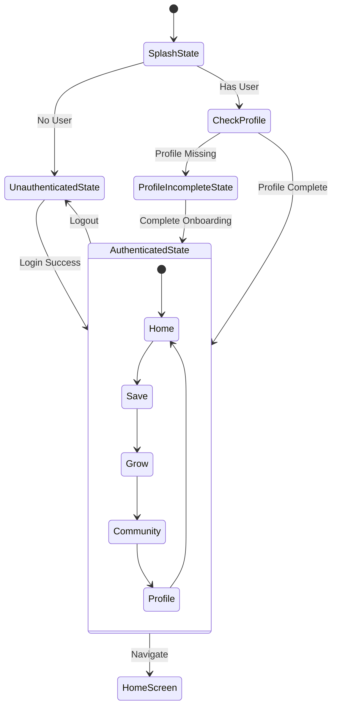

### Data Flow Architecture

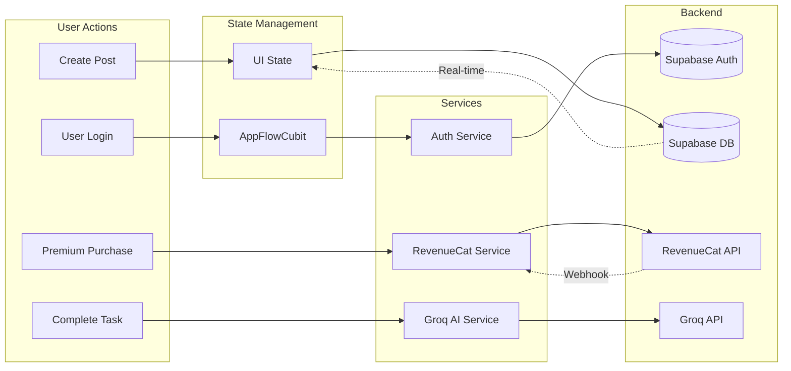

### Feature Architecture Pattern

Each feature follows a consistent structure:

```
feature/
├── screens/          # UI Layer
│   └── feature_screen.dart
├── widgets/          # Reusable components (optional)
│   └── feature_widget.dart
└── models/           # Data models (optional)
    └── feature_model.dart
```

### Key Architectural Decisions

#### 1. **State Management: BLoC (Cubit)**
- **Why**: Predictable state changes, testability, separation of concerns
- **Pattern**: Events → Cubit → States → UI
- **Implementation**: `AppFlowCubit` for global navigation, feature-specific state management in screens

#### 2. **Feature-Based Structure**
- **Why**: Scalability, easy navigation, clear boundaries
- **Pattern**: Each feature is self-contained with its own screens, widgets, and models
- **Benefits**: Easy to locate code, add new features, and maintain

#### 3. **Service Layer**
- **Why**: Centralize external API calls, reusability, testability
- **Services**:
  - `RevenueCatService` - Premium subscription management
  - `GroqAIUtils` - AI content generation
  - `SupabaseService` - Backend initialization

#### 4. **Centralized Theme**
- **Why**: Consistent design, easy customization, maintainability
- **Implementation**: `AppTheme` with color constants and text styles
- **Benefits**: Change app-wide design in one place

#### 5. **Environment Configuration**
- **Why**: Security, flexibility across environments
- **Pattern**: `.env` file with `flutter_dotenv`
- **Security**: Never commit credentials to version control

---

## 🛠️ Technology Stack

### Core Framework
| Technology | Version | Purpose |
|-----------|---------|---------|
| **Flutter** | 3.10.1+ | Cross-platform mobile framework |
| **Dart** | 3.10.1+ | Programming language |

### State Management
| Package | Version | Purpose |
|---------|---------|---------|
| **flutter_bloc** | 8.1.5 | State management using BLoC pattern |
| **bloc** | 8.1.5 | Core BLoC library |

### Backend & Database
| Service | Purpose |
|---------|---------|
| **Supabase** | Authentication, PostgreSQL database, real-time subscriptions |
| **PostgreSQL** | Relational database (via Supabase) |
| **Row Level Security** | Database security policies |

### Authentication
| Package | Purpose |
|---------|---------|
| **supabase_flutter** | Supabase Flutter SDK |
| **google_sign_in** | Google OAuth |
| **sign_in_with_apple** | Apple Sign-In |
| **crypto** | Secure hashing for auth |

### AI & Machine Learning
| Service | Model | Purpose |
|---------|-------|---------|
| **Groq API** | llama-3.1-70b-versatile | AI-powered personalization, tips, insights |

### Payments & Subscriptions
| Package | Purpose |
|---------|---------|
| **purchases_flutter** | RevenueCat SDK |
| **purchases_ui_flutter** | RevenueCat paywall UI |
| **RevenueCat** | Subscription management, entitlements |

### UI & Design
| Package | Purpose |
|---------|---------|
| **google_fonts** | Custom fonts |
| **font_awesome_flutter** | Icon library |
| **flutter_svg** | SVG rendering |
| **Custom Fonts** | Alkalami, Inter |

### Development Tools
| Package | Purpose |
|---------|---------|
| **flutter_dotenv** | Environment variable management |
| **flutter_launcher_icons** | Generate app icons |
| **http** | HTTP client |

---

## 🔐 Security

### ✅ Best Practices
- Environment variables in `.env` (git-ignored)
- Never hardcode API keys or credentials
- OAuth for secure authentication (Google, Apple)
- Row Level Security (RLS) in Supabase
- RevenueCat handles payment security
- Secure token storage

### Required Environment Variables
Create `.env` from `.env.example` with:
- `SUPABASE_URL` - Your Supabase project URL
- `SUPABASE_ANON_KEY` - Supabase anonymous key
- `REVENUECAT_API_KEY` - RevenueCat API key
- `GOOGLE_WEB_CLIENT_ID` - Google OAuth client ID
- `GROQ_API_KEY` - Groq AI API key

**Never commit `.env` to version control!**

---

## 🚀 Development

### Run the app
```bash
flutter run
```

### Hot reload
Press `R` in terminal (for code changes)

### Hot restart
Press `Shift+R` in terminal (for state/const changes)

### Generate app launcher icons
After adding your logo to `assets/images/logo/pocketnest_logo.png`:
```bash
flutter pub get
flutter pub run flutter_launcher_icons
```

### Build for Android (APK)
```bash
flutter build apk --release
```
Output: `build/app/outputs/flutter-apk/app-release.apk`

### Build for Android (App Bundle for Play Store)
```bash
flutter build appbundle --release
```

### Build for iOS
```bash
flutter build ios --release
```

### Clean rebuild
```bash
flutter clean && flutter pub get && flutter run
```

---

## 📊 Current Status: MVP Release Ready ✅

### What's Implemented
- ✅ Complete 5-tab navigation (Home, Save, Grow, Community, Profile)
- ✅ Full authentication flow (Google, Apple, Phone OTP)
- ✅ Optional onboarding (6 questions, skip allowed)
- ✅ AI-powered personalization with Groq
- ✅ Community features (posts, comments, voting)
- ✅ Premium subscription system with RevenueCat
- ✅ Profile management with settings persistence
- ✅ Micro-action task system ("Today's Gentle Step")
- ✅ Growth journey with stages and learning bites
- ✅ Modern paywall with plan offerings
- ✅ Complete Supabase backend integration

### Database Tables (Supabase)
- `profiles` - User accounts and settings
- `onboarding_responses` - Financial preferences
- `community_posts` - User-generated posts
- `community_comments` - Post comments
- `community_post_votes` - Upvote system

---

## 🔮 Future Updates (Post-MVP)

### Phase 2: Enhanced Financial Tools
- � **Push Notifications** - Saving tips, growth opportunities, and financial reminders delivered directly to users
- 📊 **Budget Tracker** - Monthly budget creation and tracking
- 💳 **Expense Categories** - Automatic categorization with AI
- 📈 **Spending Trends** - Visual charts and insights
- 🎯 **Savings Goals** - Progress tracking with milestones
- 🏦 **Bank Account Linking** - Plaid/TrueLayer integration

### Phase 3: Advanced Features
- 🤖 **AI Financial Coach** - Conversational money guidance
- 👨‍👩‍👧‍👦 **Family Sharing** - Multi-user household accounts
- 📱 **Widget Support** - Home screen widgets for quick insights
- 🎨 **UI Enhancements** - Improved animations, transitions, and user experience
- 🏆 **Achievement System** - Gamification and badges
- 📊 **Custom Reports** - Export financial data (PDF/CSV)

### Phase 4: Community & Social
- 💬 **Direct Messaging** - Private conversations between users
- 👥 **Groups & Circles** - Topic-based community subgroups
- 🎓 **Expert Q&A** - Verified financial advisors
- 📚 **Resource Library** - Curated guides and templates
- 🎉 **Challenges** - Community-wide savings challenges
- ⭐ **User Profiles** - Public profiles with achievements

### Phase 5: Premium Enhancements
- 🔐 **Advanced Security** - Biometric locks, PIN protection
- 📞 **1-on-1 Coaching** - Video calls with financial coaches
- 🧾 **Receipt Scanning** - OCR for expense tracking
- 🌍 **Multi-Currency** - Support for international users
- 📅 **Financial Calendar** - Bill due dates and payment scheduling
- 🤝 **Partner Offers** - Exclusive deals from financial partners

### Technical Improvements
- 📈 **Infrastructure Scalability** - Optimized backend for growing user base
- ⚡ **Offline Mode** - Local data sync
- 🌐 **Web Version** - Progressive Web App (PWA)
- 🖥️ **Desktop Apps** - Windows/macOS/Linux support
- 🔄 **Auto-sync** - Real-time cross-device sync
- 📊 **Analytics Dashboard** - Usage metrics for admins
- 🧪 **A/B Testing** - Feature experimentation
- 🌙 **Dark Mode** - Theme switching
- 🌍 **Localization** - Multi-language support

---

## 🐛 Troubleshooting

### Common Issues
**".env not found"**
```bash
cp .env.example .env
# Edit with your API keys and credentials
flutter clean && flutter run
```

**"No provider found for AppFlowCubit"**
- Check main.dart has BlocProvider setup
- Run hot restart (Shift+R)

**"Supabase connection failed"**
- Verify `.env` has correct URL and anon key
- Check internet connection
- Confirm Supabase project is not paused

**"RevenueCat errors"**
- Ensure `REVENUECAT_API_KEY` is set in `.env`
- Verify products are configured in RevenueCat dashboard
- Check entitlement identifier matches: `PocketNest Premium`

**"Groq AI not responding"**
- Confirm `GROQ_API_KEY` is valid
- Check API rate limits
- Verify internet connection

**"Google Sign-In fails"**
- Check `GOOGLE_WEB_CLIENT_ID` is correct
- Ensure SHA-1 certificates are added in Firebase Console
- Verify OAuth consent screen is configured

---

## 🤝 Contributing

We welcome contributions to PocketNest! Here's how you can help improve the app.

### Getting Started

1. **Fork the repository**
   ```bash
   git clone https://github.com/yourusername/pocketnest.git
   cd pocketnest
   ```

2. **Set up your environment**
   ```bash
   cp .env.example .env
   # Add your API keys to .env
   flutter pub get
   ```

3. **Create a feature branch**
   ```bash
   git checkout -b feature/your-feature-name
   ```

### Development Guidelines

#### Code Style
- Follow [Effective Dart](https://dart.dev/guides/language/effective-dart) guidelines
- Use meaningful variable and function names
- Add comments for complex logic
- Keep functions small and focused (single responsibility)

#### File Organization
- Place new features in `lib/features/[feature_name]/`
- Screens go in `screens/` subdirectory
- Reusable widgets go in `widgets/` subdirectory
- Shared components go in `lib/shared/`

#### State Management
- Use BLoC (Cubit) for state management
- Keep business logic separate from UI
- Emit states, don't return values from Cubits
- Handle loading, success, and error states

#### UI/UX
- Follow the existing design system (see `AppTheme`)
- Use consistent spacing and padding
- Ensure responsive design (test on multiple screen sizes)
- Add smooth animations for state transitions

#### Testing
- Write unit tests for business logic
- Test error cases and edge cases
- Ensure UI doesn't break on different screen sizes

### Commit Guidelines

Follow [Conventional Commits](https://www.conventionalcommits.org/):

```
feat: add expense tracking feature
fix: resolve navigation bug in profile tab
docs: update README with new screenshots
style: format code according to Dart standards
refactor: reorganize community screen components
test: add unit tests for auth service
chore: update dependencies
```

### Pull Request Process

1. **Before submitting:**
   - Run `flutter analyze` (no errors)
   - Run `dart format .` (format code)
   - Test on both Android and iOS if possible
   - Update documentation if needed

2. **PR Description:**
   - Clearly describe what changes you made
   - Reference any related issues
   - Include screenshots for UI changes
   - List any breaking changes

3. **Review Process:**
   - Maintainers will review your PR
   - Address any requested changes
   - Once approved, your PR will be merged

### Areas to Contribute

#### 🐛 Bug Fixes
Check [Issues](https://github.com/yourusername/pocketnest/issues) for bugs to fix

#### ✨ New Features
- Budget tracking
- Expense categorization
- Data visualization
- Notifications system

#### 📖 Documentation
- Improve README
- Add code comments
- Create tutorials
- Write API documentation

#### 🧪 Testing
- Write unit tests
- Add widget tests
- Integration tests
- Performance testing

#### 🎨 UI/UX Improvements
- Design new screens
- Improve animations
- Accessibility enhancements
- Dark mode support

### Code Review Checklist

Before submitting, ensure:

- [ ] Code follows Dart style guidelines
- [ ] No `flutter analyze` errors or warnings
- [ ] Code is properly formatted (`dart format .`)
- [ ] Added comments for complex logic
- [ ] UI is responsive and matches design system
- [ ] No hardcoded strings (use constants)
- [ ] No hardcoded credentials (use `.env`)
- [ ] Error handling is implemented
- [ ] Loading states are handled
- [ ] Navigation works correctly
- [ ] Updated documentation if needed

### Questions?

- 💬 Open a [Discussion](https://github.com/yourusername/pocketnest/discussions)
- 🐛 Report bugs in [Issues](https://github.com/yourusername/pocketnest/issues)
- 📧 Email: your-email@example.com

### Code of Conduct

Be respectful, inclusive, and constructive. We're all here to build something great together!

---

## 📄 License

This project is licensed under the MIT License - see the [LICENSE](LICENSE) file for details.

---

## � Copyright & License Notice

**Copyright © 2026 PocketNest. All rights reserved.**

This software and associated documentation files (the "Software") are provided under the MIT License.

### MIT License Terms

Permission is hereby granted, free of charge, to any person obtaining a copy of this software and associated documentation files, to deal in the Software without restriction, including without limitation the rights to use, copy, modify, merge, publish, distribute, sublicense, and/or sell copies of the Software, and to permit persons to whom the Software is furnished to do so, subject to the following conditions:

- The above copyright notice and this permission notice shall be included in all copies or substantial portions of the Software.
- THE SOFTWARE IS PROVIDED "AS IS", WITHOUT WARRANTY OF ANY KIND, EXPRESS OR IMPLIED, INCLUDING BUT NOT LIMITED TO THE WARRANTIES OF MERCHANTABILITY, FITNESS FOR A PARTICULAR PURPOSE AND NONINFRINGEMENT.
- IN NO EVENT SHALL THE AUTHORS OR COPYRIGHT HOLDERS BE LIABLE FOR ANY CLAIM, DAMAGES OR OTHER LIABILITY, WHETHER IN AN ACTION OF CONTRACT, TORT OR OTHERWISE, ARISING FROM, OUT OF OR IN CONNECTION WITH THE SOFTWARE OR THE USE OR OTHER DEALINGS IN THE SOFTWARE.

### Trademark Notice

PocketNest™ and the PocketNest logo are trademarks of PocketNest. Unauthorized use is prohibited.

### Third-Party Licenses

This project uses open-source libraries and services. Each dependency retains its respective license:
- Flutter (BSD-3-Clause)
- Supabase (MIT)
- RevenueCat (MIT)
- Other dependencies as specified in `pubspec.yaml`

For complete license information, see the [LICENSE](LICENSE) file.

---

## �🙏 Acknowledgments

- Flutter team for the amazing framework
- Supabase for backend infrastructure
- RevenueCat for subscription management
- Groq for AI capabilities
- All contributors who help improve PocketNest

---

<div align="center">
  <p>Made with ❤️by for busy parents managing family finances</p>
  <p>
    <a href="https://github.com/yourusername/pocketnest">⭐ Star this repo</a> •
    <a href="https://github.com/yourusername/pocketnest/issues">🐛 Report Bug</a> •
    <a href="https://github.com/yourusername/pocketnest/discussions">💬 Discussions</a>
  </p>
  <p><sub>© 2026 PocketNest. All rights reserved.</sub></p>
</div>


